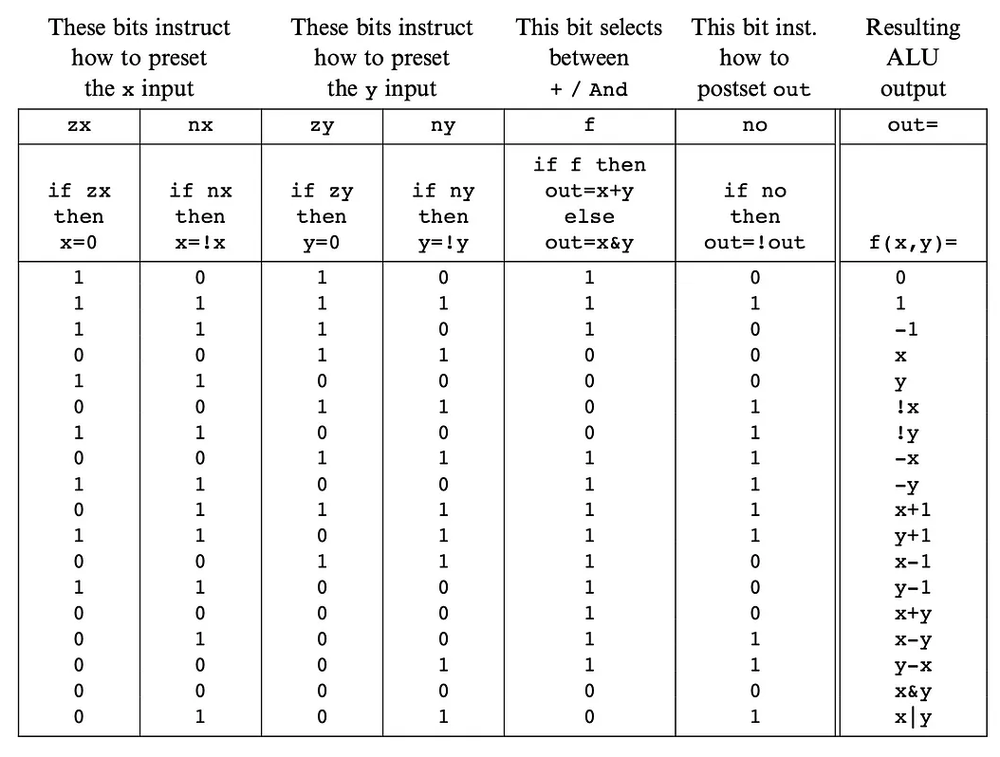

# 🖥️ 16-Bit CPU Project Using Logisim-evolution

## 📚 Table of Contents

- [📋 Project Overview](#project-overview)
- [✨ Features](#features)
- [🏛️ Architecture](#architecture)
- [🔧 Components](#components)
- [🚀 Getting Started](#getting-started)
- [📂 Usage](#usage)
- [🙏 Acknowledgments](#acknowledgments)

---

## 📋 Project Overview

This project involves designing and implementing a fully functional 16-bit CPU using [Logisim-evolution](https://github.com/logisim-evolution/logisim-evolution). The CPU is built to execute basic instructions and serves as an educational demonstration of digital logic design and computer architecture principles.

### Goals:

- Understand and implement key concepts of computer architecture.
- Learn to design and test digital circuits using Logisim-evolution.
- Build a modular and extensible CPU architecture.

---

## ✨ Features

- **16-bit ALU**: Performs arithmetic and logical operations.
- **Registers**: General-purpose and special-purpose registers.
- **Memory**: Includes 16k RAM for program and data storage.

---

## 🏛️ Architecture

The CPU is designed using a modular approach, divided into key components:

### 1. **Arithmetic Logic Unit (ALU)**:

- Supports operations like ADD, SUB, AND, OR, NOT, and XOR.
- Status flags for zero, carry.

<p align="center">
    
</p>

### 2. **Registers**:

- General-purpose registers.

### 3. **Control Unit**:

### 4. **Memory**:

- RAM module for instruction and data storage.
- Addressable space based on a 16-bit address bus.

### 5. **Instruction Set**:

---

## 🔧 Components

Below are the core components designed in Logisim-evolution:

- **ALU Circuit**: Performs arithmetic and logical operations.
- **Register File**: Stores data during program execution.
- **Control Circuit**: Handles instruction decoding and control signals.
- **Memory Module**: Stores programs and data.
- **Program Counter**: Increment and store a data. Can be reset.

---

## 🛠️ Getting Started

### Prerequisites

- Install [Logisim-evolution](https://github.com/logisim-evolution/logisim-evolution).
- Basic understanding of digital logic design.
- Familiarity with computer architecture concepts.

### Installation

1. Clone this repository:
   ```bash
   git clone https://github.com/Silvec-aka/CPU-w-logisim.git
   ```
2. Open the project in Logisim-evolution:
   - Launch Logisim-evolution.
   - Open the `.circ` file in the repository.

---

## 📂 Usage

1. Load the CPU circuit in Logisim-evolution.
2. Set up a program in the memory module using the pre-defined format.
3. Start the simulation by activating the clock.
4. Monitor the registers, ALU, and memory for execution results.

### Example Program

---

## 🙏 Acknowledgments

- [Logisim-evolution](https://github.com/logisim-evolution/logisim-evolution) for providing an excellent and open source tool for digital logic design.
- [The Elements of Computing Systems, second edition](https://mitpress.mit.edu/9780262539807/the-elements-of-computing-systems/)
