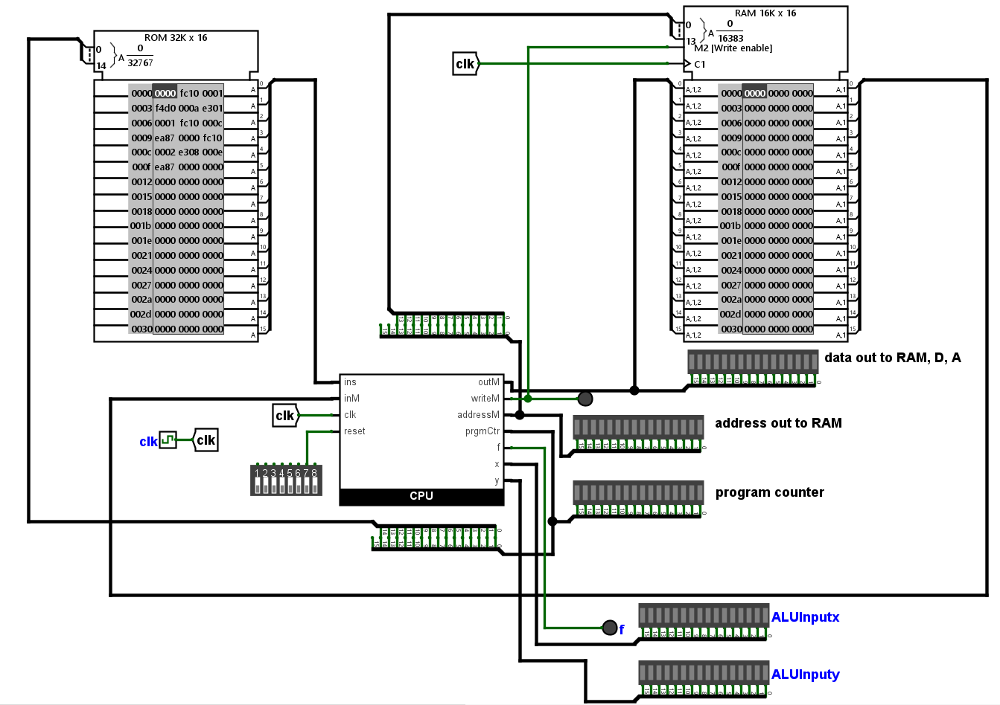

# 🖥️ 16-Bit CPU Project Using Logisim-evolution

## 📚 Table of Contents

- [📋 Project Overview](#project-overview)
- [✨ Features](#features)
- [🔧 Components](#components)
- [🏛️ Assembly Instructions](#Assembly-Instructions)
- [🚀 Getting Started](#getting-started)
- [📂 Usage](#usage)
- [🙏 Acknowledgments](#acknowledgments)

---

## 📋 Project Overview

This project involves the implementation of a simple 16-bit CPU designed in
[Logisim-evolution](https://github.com/logisim-evolution/logisim-evolution).
The CPU is built as part of an educational project inspired by the
[Nand2Tetris](https://www.nand2tetris.org/) course. It demonstrates the basics
of computer architecture, including instruction execution, memory management,
and arithmetic operations.

### Goals:

- Understand and implement key concepts of CPU architecture.
- Build a modular CPU architecture.
- Learn to design and test digital circuits using Logisim-evolution.

---

## ✨ Features

- **16-bit Architecture**: Supports 16-bit instructions and data.
- **Arithmetic Logic Unit (ALU)**: Performs essential arithmetic and logical
  operations such as addition, subtraction, and bitwise AND/OR.
- **Registers**: Includes general-purpose registers and a program counter for
  instruction execution.
- **Memory**: Features ROM for program storage and RAM for data storage.
- **Instruction Set**: Executes a small, custom-designed instruction set.

---

## 🔧 Components

Below are the core components designed in Logisim-evolution:

- **ALU Circuit**: Performs arithmetic and logical operations.
- **Register File**: Stores data during program execution.
- **Control Circuit**: Handles instruction decoding and control signals.
- **Memory Module**: Stores programs and data.
- **Program Counter**: Increment and store a data. Can be reset.

---

## 🏛️ Assembly Instructions

The CPU is designed to use specific assembly instruction. There is two type of
instruction, A and C.

#### A-instruction

`Symbolic : @x` x is a decimal value.

`Binary : 0 a1 a2 a3 a4 a5 a6 a7 a8 a9 a10 a11 a12 a13 a14 a15` aa..a is the 15
bits value of x.

x is the decimal value of a 15-bit address ranging from 0 to 32767.
When the instruction is used we can then access the information at the location
and use it.

#### C-instruction

`Symbolic : dest = comp; jump` Only comp is mandatory.

`Binary : 1 1 1 a c1 c2 c3 c4 c5 c6 d1 d2 d3 j1 j2 j3`

This type of instruction is more complex and I will not detail here how it works.
I'll simply explain here what compose this instrustion and what it does in the CPU.

First come the `acccccc` part which is here to directly follow the ALU implemention.

ALU Logic table:

<p align="center">
    
</p>

Operators table of `acccccc`:

if a=0:

| **comp** | **c1** | **c2** | **c3** | **c4** | **c5** | **c6** |
| -------- | ------ | ------ | ------ | ------ | ------ | ------ | --- |
| 0        | 1      | 0      | 1      | 0      | 1      | 0      |
| 1        | 1      | 1      | 1      | 1      | 1      | 1      |
| -1       | 1      | 1      | 1      | 1      | 1      | 1      |
| D        | 0      | 0      | 1      | 1      | 0      | 0      |
| A        | 1      | 1      | 0      | 0      | 1      | 0      |
| !D       | 0      | 1      | 1      | 1      | 0      | 0      |
| !A       | 1      | 1      | 0      | 1      | 1      | 0      |
| -D       | 0      | 1      | 1      | 1      | 1      | 0      |
| -A       | 1      | 1      | 0      | 1      | 1      | 1      |
| D+1      | 0      | 1      | 1      | 1      | 1      | 1      |
| A+1      | 1      | 1      | 0      | 1      | 1      | 1      |
| D-1      | 0      | 0      | 1      | 1      | 0      | 0      |
| A-1      | 1      | 1      | 0      | 0      | 1      | 0      |
| D+A      | 0      | 0      | 0      | 0      | 0      | 0      |
| D-A      | 0      | 1      | 1      | 1      | 0      | 1      |
| A-D      | 1      | 1      | 0      | 0      | 0      | 1      |
| D&A      | 0      | 0      | 0      | 0      | 0      | 0      |
| D        | A      | 0      | 1      | 1      | 1      | 0      | 1   |

if a=1:
| **comp** | **c1** | **c2** | **c3** | **c4** | **c5** | **c6** |
|----------|--------|--------|--------|--------|--------|--------|
| M | 1 | 0 | 1 | 0 | 1 | 0 |
| !M | 1 | 0 | 1 | 1 | 1 | 0 |
| -M | 1 | 0 | 1 | 1 | 1 | 1 |
| M+1 | 1 | 0 | 1 | 1 | 1 | 1 |
| M-1 | 1 | 0 | 1 | 0 | 1 | 0 |
| D+M | 0 | 0 | 0 | 0 | 0 | 0 |
| D-M | 0 | 1 | 1 | 1 | 0 | 1 |
| M-D | 1 | 1 | 0 | 0 | 0 | 1 |
| D&M | 0 | 0 | 0 | 0 | 0 | 0 |
| D|M | 0 | 1 | 1 | 1 | 0 | 1 |

Destination table for `ddd`:
|dest|d|d|d|Effect: store _comp_ in|
|:---:|:---:|:---:|:---:|:---:|
null|0|0|0|the value is not stored
M|0|1|1|RAM[A]
D|0|1|0|D register (reg)
DM|0|1|1|D register and RAM[A]
A|1|0|0|A reg
AM|1|0|1|A reg and RAM[A]
AD|1|1|0|A reg and D reg
ADM|1|1|1|A reg, D reg, and RAM[A]

Comparison table for `jjj`:
|mnemonic|j1|j2|j3|Effect|
|:---:|:---:|:---:|:---:|:---:|
null|0|0|0|no jump
JGT|0|0|1|if _comp_ > 0 jump
JEQ|0|1|0|JEQ|if _comp_ = 0 jump
JGE|0|1|1|JGE|if _comp_ ≥ 0 jump
JLT|1|0|0|JLT|if _comp_ < 0 jump
JNE|1|0|1|JNE|if _comp_ ≠ 0 jump
JLE|1|1|0|JLE|if _comp_ ≤ 0 jump
JMP|1|1|1|JMP|unconditionnal jump

---

## 🛠️ Getting Started

To explore and simulate the CPU design, follow these steps:

### Prerequisites

- Install [Logisim-evolution](https://github.com/logisim-evolution/logisim-evolution).
- Basic understanding of digital logic design.
- Familiarity with computer architecture concepts.

### Steps

1. **Clone the Repository**:
   ```bash
   git clone https://github.com/Silvec-aka/HackCPU-Logisim.git
   cd HackCPU-Logisim
   ```
2. **Open in Logisim-evolution**:

   - Launch Logisim-evolution.
   - Open the `CPULib.circ` file from the cloned repository in `Elements/CPU`.

3. **Simulate the CPU**:
   - Load a program into the ROM module.
   - Run the simulation to observe how instructions are executed.

---

## 📂 Usage

### Loading a Program

To load a program into the CPU:

- Open the ROM module in Logisim-evolution.
- Input the machine code instructions directly into the ROM.

### Observing Execution

- Use the clock to step through each instruction.
- Monitor the state of the registers, ALU, and memory in real time.

### Example Program

Here is an example of a simple program (its the Max.hack in example files):

<p align="center">
    
</p>

---

## 🙏 Acknowledgments

- [Logisim-evolution](https://github.com/logisim-evolution/logisim-evolution)
  for providing an excellent and open source tool for digital logic design.
- **Nand2Tetris**: The [Nand2Tetris](https://www.nand2tetris.org/) course for
  inspiring this project.
- [The Elements of Computing Systems, second edition](https://mitpress.mit.edu/9780262539807/the-elements-of-computing-systems/)
